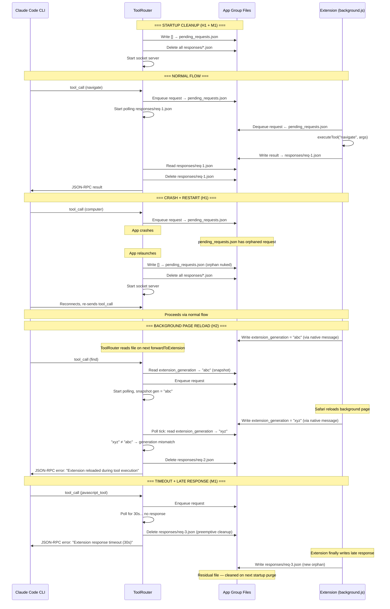

# Spec 023 — Crash/Restart Resilience

> **Status:** Draft
> **PR scope:** H1 (stale queue replay), H2 (background page reload detection), M1 (orphaned response files)

## Problem

The native app and Safari extension communicate via App Group files (`pending_requests.json`, `responses/*.json`). These files persist across process restarts. When the native app crashes mid-tool-call and relaunches:

1. **H1 — Stale queue replay:** `pending_requests.json` may contain requests from a dead CLI session. On relaunch, the extension dequeues and executes them. Results go to a `clientId` that no longer exists — `failPendingRequest` silently drops them after 30s.
2. **H2 — Background page reload:** If Safari reloads the background page mid-tool-call, the in-flight `executeTool` promise is destroyed. The native app keeps polling the response file for 30s before surfacing an error. There is no mechanism to detect the reload.
3. **M1 — Orphaned response files:** When `failPendingRequest` fires (30s timeout), it does not delete the response file. If the extension writes a response after the timeout, the file persists on disk indefinitely until the next startup purge.

## Design

### Startup Cleanup (H1 + M1)

On startup, before the socket server accepts connections, `ToolRouter` performs a one-time cleanup:

1. Write `[]` (empty JSON array) to `pending_requests.json`
2. Delete all `*.json` files in `<AppGroup>/responses/`

**Why this is safe:** At startup, no CLI client is connected yet (the socket server hasn't started). Any requests in the queue are from a dead session with no client to receive responses. The CLI will reconnect and re-send.

**Integration point:** `ToolRouter.performStartupCleanup()` called from `AppDelegate.startMCPServer()` after `toolRouter?.setServer(server)` and `mcpServer?.delegate = toolRouter` but before `try mcpServer?.start()`. All cleanup operations are best-effort (`try?`) — if the App Group is unavailable at startup, the server still starts and cleanup is skipped.

### Extension Generation Marker (H2)

The extension writes a generation marker on load. ToolRouter checks it during response polling to detect reloads within one poll tick (~50ms) instead of waiting 30s.

**Extension side (`background.js`):**
- On load, generate `extensionGeneration = Date.now() + "-" + Math.random()`
- Send `{ type: "extension_ready", generation: "<value>" }` via `browser.runtime.sendNativeMessage()`
- No new background script file is added — this is inline in `background.js` before `pollForRequests()`. The load-order comment does not need updating.

**Native bridge (`SafariWebExtensionHandler.swift`):**
- Handle `"extension_ready"` message type (matching the JS message type exactly)
- Write the generation string to `<AppGroup>/extension_generation` — best-effort (`try?`). No directory creation needed; the file is written directly to the App Group container root, which always exists when the App Group is available.
- Respond with `{ "status": "ok" }` regardless of write outcome. If the write fails, the generation check is silently skipped on the ToolRouter side (nil semantics), which is acceptable — generation detection is advisory, not blocking.

**Native side (`ToolRouter.swift`):**
- Generation is read from the App Group file, not stored as an in-memory property. This avoids cross-thread synchronization issues — `pollForExtensionResponse` already runs on `DispatchQueue.global(qos: .userInitiated)` and file reads are inherently safe.
- `forwardToExtension()` reads `<AppGroup>/extension_generation` and snapshots the value at call time
- `pollForExtensionResponse()` re-reads the file on each tick
- If generation changed mid-poll → fail immediately with `"Extension reloaded during tool execution"`
- **Check ordering:** The generation check fires only when no response file is found on a given tick. If a response file exists, it is consumed normally regardless of generation change — a reload that happens after the extension writes its response must not discard that valid response.
- **Nil semantics:** If the snapshot generation is `nil` (extension hasn't sent `extension_ready` yet — e.g., first tool call arrives before the native message round-trip completes), the generation check is skipped entirely. The poll falls through to the normal 30s timeout. This is the correct behavior: if we've never heard from the extension, we can't distinguish "not yet loaded" from "reloaded."

**Failure sequence:**
1. CLI sends tool call → ToolRouter enqueues, reads generation file (`"abc"`), snapshots it, starts polling
2. Safari reloads background page → extension sends `extension_ready` with gen `"xyz"` → written to file
3. ToolRouter poll tick reads file `"xyz"` ≠ `"abc"` → fails immediately
4. Response file is deleted (M1 cleanup)
5. CLI receives error, can retry

### Response File Cleanup on Timeout (M1 ongoing)

When `failPendingRequest` fires (timeout or generation mismatch), delete the response file for that `requestId`:

```swift
if let url = AppConstants.responseFileURL(for: requestId) {
    try? FileManager.default.removeItem(at: url)
}
```

This is belt-and-suspenders with the startup purge. **Residual case:** If the extension writes a response *after* `failPendingRequest` deletes the file, a new orphaned file is created. This is acceptable — the file is small (a few KB) and will be cleaned up on the next app startup. There is no mechanism to prevent this race without bidirectional coordination, which is not worth the complexity.

### Out-of-Scope Gap: Client Disconnect Path

The existing `socketServer(_:didDisconnect:)` handler removes the request from `pendingRequests` but does not call `failPendingRequest`. This means the `pollForExtensionResponse` loop terminates (because `pendingRequests[requestId]` is nil), but the response file is not deleted. This is a pre-existing gap that predates this spec. It is intentionally not addressed here because:
- The startup purge (H1) catches these orphans on next launch
- The disconnect path would need its own response-file cleanup, which is a separate concern from crash resilience

## Sequence Diagram



## Files Changed

| File | Change | Issue |
|------|--------|-------|
| `ToolRouter.swift` | Add `performStartupCleanup()` method | H1 |
| `ToolRouter.swift` | Read generation file in `forwardToExtension`, check on each poll tick | H2 |
| `ToolRouter.swift` | Delete response file in `failPendingRequest` | M1 |
| `SafariWebExtensionHandler.swift` | Handle `"extension_ready"` message type — write generation to file | H2 |
| `AppDelegate.swift` | Call `performStartupCleanup()` before `mcpServer?.start()` | H1 |
| `background.js` | Send `extension_ready` with generation on load (inline, no new script file) | H2 |
| `Constants.swift` | Add `extensionGenerationURL` computed property | H2 |

**STRUCTURE.md:** No update needed. No new source files are created. The App Group runtime files (`extension_generation`, `pending_requests.json`, `responses/`) are existing IPC artifacts, not source files.

## Testing

| Test | What it verifies |
|------|-----------------|
| `testPerformStartupCleanup_truncatesQueue` | `pending_requests.json` is `[]` after cleanup |
| `testPerformStartupCleanup_deletesResponseFiles` | `responses/` directory is empty after cleanup |
| `testPerformStartupCleanup_appGroupUnavailable` | Cleanup is no-op (no crash) when App Group is nil |
| `testPollForExtensionResponse_generationMismatch` | Poll fails immediately when generation file changes |
| `testPollForExtensionResponse_nilGeneration` | Poll does NOT fail when snapshot generation is nil (first call before extension ready) |
| `testFailPendingRequest_deletesResponseFile` | Response file is removed on timeout |
| JS: `extension_ready sent on load` | `background.js` sends generation message at startup |

## Safari Degradations

None. This spec affects only the native app ↔ extension IPC layer, not browser-facing behavior.

## Not In Scope

- launchd auto-restart (deferred to distribution PR)
- `computer.js` tab-closed guards (PR 2: tool execution guards)
- Tab group pruning, poll backoff, image TTL (PR 3: resource management)
- Client disconnect response-file cleanup (pre-existing gap, mitigated by startup purge)
