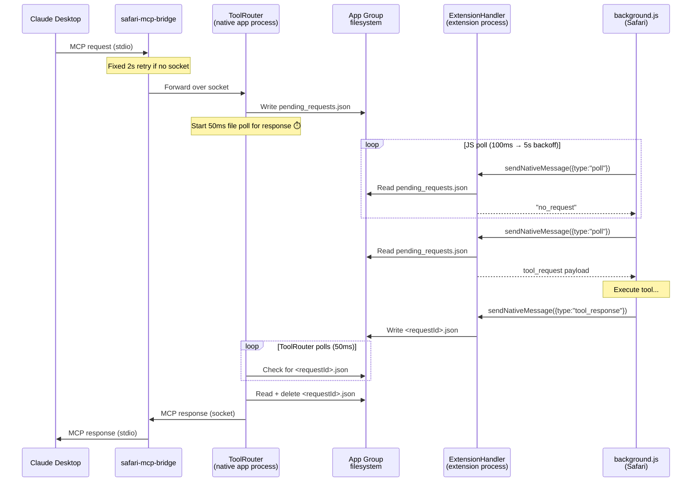
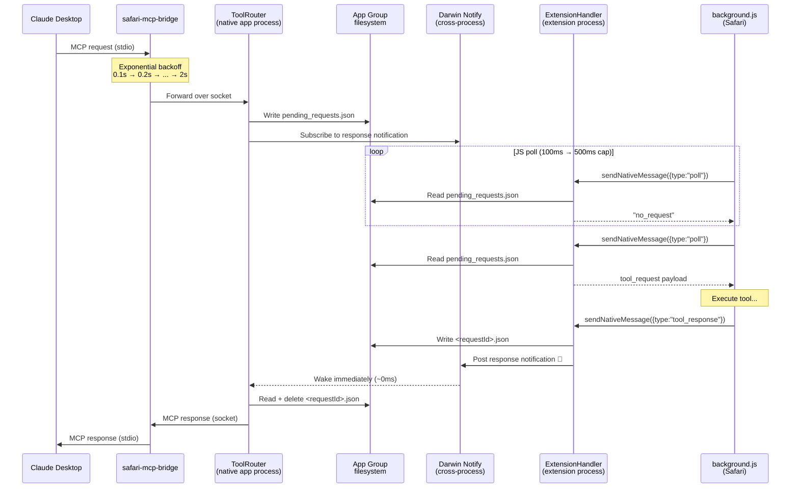
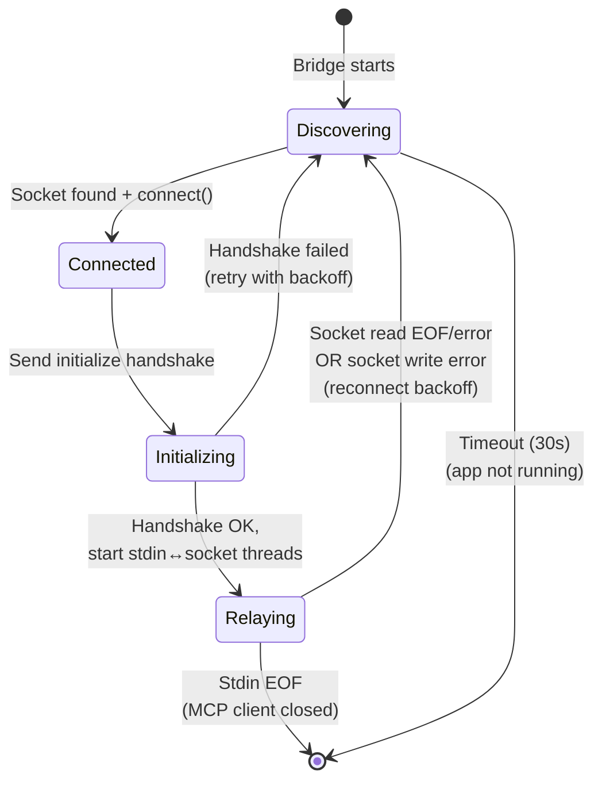

# Spec 029: Responsive Polling & Bridge Resilience

## Problem

The v1.2.2 Desktop bridge works but feels sluggish and fragile. Three stacked polling loops accumulate latency on every tool call, and the bridge exits on socket disconnect with no recovery path.

**Measured worst-case latency per tool call:**
- Extension JS idle poll backoff: **1–5 seconds** (after ~13s of inactivity)
- ToolRouter response file polling: **0–50ms** per call
- Bridge cold start retry: **0–2 seconds** per attempt

**Reliability gap:** If the native app restarts (crash, update, user quit/relaunch), the bridge process exits and Claude Desktop must re-spawn it. There is no reconnection.

## Goals

1. **Speed:** Reduce worst-case first-tool-call latency from ~5s to < 500ms
2. **Speed:** Eliminate per-call response polling overhead (50ms → ~0ms)
3. **Resilience:** Bridge survives native app restarts without Claude Desktop intervention
4. **Resilience:** Bridge cold-start connects faster when the app is already running

## Non-Goals

- Replacing the App Group filesystem as the data transport between processes (the native app and extension handler run in separate processes — the filesystem is the correct IPC mechanism)
- Changing the extension JS ↔ `SafariWebExtensionHandler` native messaging protocol
- Changing the MCP socket protocol or framing

## Architecture

### Current Flow (3 stacked polling loops)



### Proposed Flow (event-driven response path)



### Latency Comparison

| Source | Before | After |
|--------|--------|-------|
| JS idle poll (worst case) | 5,000ms | 500ms |
| Response file detection | 0–50ms | ~0ms (Darwin notify) |
| Bridge cold start (app running) | 0–2,000ms | ~100ms typical |
| Bridge cold start (app not running) | 0–30,000ms | 0–30,000ms (unchanged) |

## Design

### Change 1: Cap Extension Idle Poll Interval

**File:** `ClaudeInSafari Extension/Resources/background.js`

**Current behavior:** When idle, the poll interval doubles each cycle: 100ms → 200ms → 400ms → 800ms → 1600ms → 3200ms → 5000ms (capped). After ~13 seconds of inactivity, the extension only checks for requests every 5 seconds.

**Proposed behavior:** Cap the idle interval at 500ms instead of 5,000ms.

```javascript
// Before
const POLL_IDLE_INTERVAL_MS = 5000;

// After
const POLL_IDLE_INTERVAL_MS = 500;
```

**Trade-off:** ~2 extra `sendNativeMessage` calls per second when idle (vs ~0.2 at the old 5s cap). Each is a lightweight no-op round-trip — `sendNativeMessage` is a fast synchronous IPC call, and the handler returns immediately when the queue is empty.

**Why 500ms and not lower:** Below 500ms, we're approaching the active-mode interval (100ms) with no benefit — if tool calls are arriving that fast, `isActive` will be true and we'll already be at 100ms. 500ms is the sweet spot: imperceptible to users (< 1s worst case) while still backing off meaningfully when truly idle.

### Change 2: Bridge Exponential Backoff

**File:** `safari-mcp-bridge/BridgeRelay.swift`

**Current behavior:** Fixed 2-second `sleep()` between retry attempts. If the app socket appears 100ms after a check, the bridge waits 1.9 seconds for nothing.

**Proposed behavior:** Exponential backoff starting at 100ms, doubling each iteration, capped at 2 seconds.

```
Attempt 1: wait 100ms
Attempt 2: wait 200ms
Attempt 3: wait 400ms
Attempt 4: wait 800ms
Attempt 5: wait 1,600ms
Attempt 6: wait min(3,200ms, 2,000ms) = 2,000ms
Attempt 7+: wait 2,000ms (cap)
```

**Implementation:** Replace the fixed `sleep(socketPollInterval)` with `usleep()` using a doubling delay variable. The `elapsed` tracking must change from `Int` (seconds) to milliseconds (`UInt64`) to accommodate sub-second granularity. The 30-second total timeout is preserved.

**Why not lower than 100ms:** Below 100ms, the filesystem stat calls for socket discovery become noticeable. 100ms is fast enough that cold-start connection typically completes in 1–2 attempts when the app is already running.

### Change 3: Darwin Notification for Response Delivery

**Files:** `ClaudeInSafari Extension/SafariWebExtensionHandler.swift`, `ClaudeInSafari/MCP/ToolRouter.swift`

**Current behavior:** After enqueuing a tool request, `ToolRouter.pollForExtensionResponse()` checks for `<requestId>.json` every 50ms via `Data(contentsOf:)`. Over the 30-second timeout, this is up to 600 filesystem reads.

**Proposed behavior:** Replace the 50ms polling loop with a Darwin notification subscription.

**Notification name:** `com.chriscantu.claudeinsafari.response-ready`

**Flow:**

1. `ToolRouter.forwardToExtension()` subscribes to the Darwin notification before enqueuing the request.
2. `SafariWebExtensionHandler.handleToolResponse()` writes the response file (unchanged), then posts the Darwin notification.
3. ToolRouter's notification handler fires on its delegate queue. It checks whether the response file matches any pending request ID, reads it, deletes it, and delivers the MCP response.
4. A fallback 500ms poll timer remains as a safety net — if the Darwin notification is lost (process restart, system pressure), the response is still picked up within 500ms. This preserves the existing timeout and generation-mismatch detection.

**API:**

```swift
// Post (extension handler — after writing response file)
let center = CFNotificationCenterGetDarwinNotifyCenter()
let name = "com.chriscantu.claudeinsafari.response-ready" as CFString
CFNotificationCenterPostNotification(center, CFNotificationName(name), nil, nil, true)

// Subscribe (ToolRouter — on startup, called from delegateQueue)
CFNotificationCenterAddObserver(
    center, observerPtr, { _, observer, _, _, _ in
        // Callback fires on an undefined thread — dispatch to known serial queue
        guard let observer = observer else { return }
        let router = Unmanaged<ToolRouter>.fromOpaque(observer).takeUnretainedValue()
        router.responseQueue.async {
            router.checkAllPendingResponses()
        }
    },
    name, nil, .deliverImmediately
)
```

**Thread safety:** The Darwin notification callback fires on an undefined thread (determined by the CFRunLoop/dispatch context at registration time). The callback must **not** touch `pendingRequests`, filesystem state, or call `deliverExtensionResponse` directly. Instead, it dispatches to a dedicated serial queue:

```swift
private let responseQueue = DispatchQueue(label: "com.chriscantu.claudeinsafari.response")
```

`checkAllPendingResponses()` iterates all entries in `pendingRequests` (under lock), checks for each request's response file, and delivers any that exist. This also handles the concurrent-notification case — a single scan picks up all ready responses regardless of how many notifications fired.

**Observer pointer:** Store `Unmanaged<ToolRouter>.passUnretained(self).toOpaque()` at registration time. The same pointer is required for `CFNotificationCenterRemoveObserver`.

**Why Darwin notifications:**
- Cross-process: works between the native app and extension helper processes
- Zero overhead when idle: no polling, no filesystem reads
- Built into macOS: no dependencies, uses `notify_post()`/`notify_register_dispatch()` under the hood
- Lightweight: a single mach message per notification

**Sandbox verification required:** Darwin notifications use Mach-based `notify_post()` under the hood. While the native app process can use these under App Sandbox, the extension handler process (`SafariWebExtensionHandler`) runs in a more restrictive `appex` sandbox managed by `pluginkit`. Apple's documentation does not explicitly guarantee Darwin notify access from app extension processes.

**Implementation gate:** Before implementing Change 3, write a minimal proof-of-concept that posts a Darwin notification from `SafariWebExtensionHandler.handleToolResponse()` and observes it in the native app process. If this fails in the `appex` sandbox:
- **Contingency:** Skip the notification post from the extension handler and rely solely on the 500ms fallback poll. Change 3 degrades gracefully — worst-case response latency becomes 500ms instead of ~0ms, which is still a 10x improvement over the current 50ms poll (which accumulates to 0-50ms per call but causes 600 filesystem reads over the timeout period). The Darwin notification subscription in ToolRouter is still set up (for future use if the sandbox restriction is lifted or for native tools that respond in-process), but the primary delivery mechanism becomes the fallback poll.

**Why keep a fallback poll:**
- Darwin notifications are not guaranteed delivery — if the subscriber process restarts between post and delivery, the notification is lost
- The extension generation mismatch check (background page reload detection) still needs periodic evaluation
- Belt-and-suspenders: the fallback poll at 500ms means worst case we're no slower than the current JS poll cap
- Required for the contingency path if Darwin notify doesn't work from the `appex` sandbox

**Notification callback must check liveness:** The callback (and the fallback poll) must verify that `requestId` is still in `pendingRequests` before processing. If the 30s deadline has already passed and `failPendingRequest` has cleaned up the entry, a late notification must be a no-op. The existing check at `ToolRouter.swift:847-850` applies to both paths.

**Cleanup:** `ToolRouter.stop()` must call `CFNotificationCenterRemoveObserver` using the stored observer pointer. This must happen in `stop()`, not `deinit`, because by the time `deinit` runs the `Unmanaged` pointer to `self` is already dangling.

### Change 4: Bridge Auto-Reconnect

**File:** `safari-mcp-bridge/BridgeRelay.swift`

**Current behavior:** `run() -> Never` connects once. When either the stdin→socket or socket→stdout relay detects EOF/error, both threads exit via `DispatchGroup`, and the process terminates with exit code 0 or 1.

**Proposed behavior:** When any socket-side error occurs (read EOF, read error, or write error on the stdin→socket thread), the bridge re-enters the socket discovery loop with exponential backoff and re-initializes the MCP session. Stdin EOF still means the MCP client is done and triggers a clean exit.

**State machine:**



**MCP re-initialization on reconnect:**

The bridge is a byte relay — the MCP client (Claude Desktop) sees an unbroken stdin/stdout pipe and has no way to know the upstream ToolRouter restarted. But the new ToolRouter expects an `initialize` handshake before accepting `tools/call` requests. Without re-initialization, the first tool call after reconnect would be rejected.

**Solution:** After reconnecting, the bridge sends a fresh `initialize` + `notifications/initialized` handshake to the new ToolRouter, consuming the response internally (not forwarding to stdout). This reuses the existing logic from `verifyConnection()`. The MCP client is unaware of the reconnection.

**Reconnect flow:**

1. Socket-side error detected (read EOF, read error, or write error)
2. Both relay threads drain via `DispatchGroup`
3. Bridge logs `"Connection lost. Reconnecting..."` to stderr
4. Close old socket fd
5. Re-enter discovery loop with exponential backoff (same curve as Change 2)
6. On successful connect, send `initialize` request, read response, send `notifications/initialized` (reuse `verifyConnection` logic)
7. If handshake fails, treat as connection failure — retry discovery
8. On successful handshake, resume stdin↔socket relay threads

**In-flight request handling:** Any MCP request that was in-flight when the socket dropped is lost — the old ToolRouter is gone. The MCP client will timeout on that request and may retry. This is acceptable: MCP clients already handle server-side timeouts, and the alternative (buffering and replaying requests) would require the bridge to parse and understand the full MCP protocol.

**Partial buffer handling:** On reconnect, any partial (incomplete) message in the stdin read buffer is preserved — it's valid data from the MCP client that just hasn't been fully received yet. The bridge continues reading from stdin into the same buffer. Complete messages are forwarded to the new socket after the handshake completes.

**Timeout and exit conditions:**
- The 30-second timeout applies per reconnection attempt. If the app doesn't come back within 30 seconds, the bridge exits.
- Stdin EOF at any point causes immediate exit (the MCP client is done).
- Reconnect attempts are logged to stderr so Claude Desktop can surface them.

**Why not infinite retries:** A 30-second cap per reconnect attempt prevents the bridge from running forever if the user quits the app intentionally. Claude Desktop will re-spawn the bridge on the next tool call if needed.

## Testing

### Unit Tests

| Test | File | Validates |
|------|------|-----------|
| Idle poll interval capped at 500ms | `Tests/JS/background.test.js` | `POLL_IDLE_INTERVAL_MS` constant, backoff formula never exceeds 500ms |
| Bridge backoff is exponential | `Tests/Swift/BridgeRelayTests.swift` | Backoff sequence: 100ms, 200ms, 400ms, 800ms, 1600ms, 2000ms, 2000ms |
| Darwin notification triggers response delivery | `Tests/Swift/ToolRouterTests.swift` | Post notification → pending request is resolved (mock file) |
| Fallback poll fires at 500ms | `Tests/Swift/ToolRouterTests.swift` | Response file present but no notification → delivered within 500ms |
| Bridge reconnects on socket EOF | `Tests/Swift/BridgeRelayTests.swift` | Socket close → bridge re-enters discovery → connects to new socket |
| Bridge reconnects on socket write error | `Tests/Swift/BridgeRelayTests.swift` | Write failure on stdin→socket thread → reconnect (not just read EOF) |
| Bridge re-initializes MCP after reconnect | `Tests/Swift/BridgeRelayTests.swift` | After reconnect, bridge sends initialize + notifications/initialized before relaying |
| Bridge exits on stdin EOF | `Tests/Swift/BridgeRelayTests.swift` | Stdin close → bridge exits (no reconnect) |
| Concurrent responses delivered via single notification | `Tests/Swift/ToolRouterTests.swift` | Two pending requests, both response files written, single notification → both delivered |

### Integration Tests

| Test | Command | Validates |
|------|---------|-----------|
| Full round-trip latency | `make send TOOL=read_page` | Tool completes within expected latency bounds |
| Bridge survives app restart | Manual: `make kill && make run` while bridge is connected | Bridge reconnects and next tool call succeeds |
| Validate bridge after changes | `make validate-bridge` | Binary, config, and relay checks pass |

### Regression

All existing tests in `make test-all` must continue to pass. The `docs/regression-tests.md` manual suite is required before merge per PRINCIPLES.md rule 8.

## Files Changed

| File | Change |
|------|--------|
| `ClaudeInSafari Extension/Resources/background.js` | Change `POLL_IDLE_INTERVAL_MS` from 5000 to 500 |
| `safari-mcp-bridge/BridgeRelay.swift` | Exponential backoff in retry loop; auto-reconnect outer loop |
| `ClaudeInSafari/MCP/ToolRouter.swift` | Replace 50ms file poll with Darwin notification subscription + 500ms fallback |
| `ClaudeInSafari Extension/SafariWebExtensionHandler.swift` | Post Darwin notification after writing response file |
| `Tests/JS/background.test.js` | Test idle poll cap |
| `Tests/Swift/BridgeRelayTests.swift` | Test exponential backoff, reconnect behavior |
| `Tests/Swift/ToolRouterTests.swift` | Test Darwin notification response delivery, fallback poll |

## Observability

Reliability improvements are hard to validate without usage data. The following instrumentation lets us measure the actual impact after deployment.

### Bridge Metrics (stderr)

The bridge already logs to stderr, which Claude Desktop can capture. Add structured log lines for:

| Event | Log format | Purpose |
|-------|-----------|---------|
| Connection established | `bridge: connected in {elapsed_ms}ms (attempt {n})` | Measure cold-start latency |
| Reconnect started | `bridge: connection lost, reconnecting...` | Count disconnections |
| Reconnect succeeded | `bridge: reconnected in {elapsed_ms}ms (attempt {n})` | Measure recovery time |
| Reconnect failed (timeout) | `bridge: reconnect failed after 30s, exiting` | Count unrecoverable failures |
| MCP re-initialization | `bridge: session re-initialized ({tool_count} tools)` | Confirm handshake works post-reconnect |

### ToolRouter Metrics (NSLog)

| Event | Log format | Purpose |
|-------|-----------|---------|
| Response via Darwin notify | `ToolRouter: response for {requestId} delivered via notification ({elapsed_ms}ms)` | Measure notification-path latency |
| Response via fallback poll | `ToolRouter: response for {requestId} delivered via fallback poll ({elapsed_ms}ms)` | Measure fallback frequency and latency |
| Darwin notify unavailable | `ToolRouter: Darwin notification not received, fell back to poll` | Detect sandbox blocking (one-time at startup POC) |

### Extension Metrics (console.log)

| Event | Log format | Purpose |
|-------|-----------|---------|
| Poll interval at request pickup | `Poll: picked up request after {idle_ms}ms idle (interval was {interval}ms)` | Measure actual idle-to-active latency |

### `--status` Output

Extend `StatusReporter.swift` (the `safari-mcp-bridge --status` diagnostic) to include:

- Current session uptime
- Number of reconnections in current session
- Last response delivery method (notify vs fallback poll)
- Average response delivery latency (last 10 requests)

This surfaces in `make bridge-status` and `make doctor`, making it easy to check health during development and support.

### Success Criteria (post-deployment)

After one week of real usage, check:

1. **Reconnect success rate:** >90% of socket disconnections should recover without bridge exit
2. **First-tool latency:** p95 idle-to-active latency should be < 600ms (500ms cap + overhead)
3. **Response delivery:** >80% of responses delivered via Darwin notify (if POC passes); 100% via fallback poll otherwise
4. **No regressions:** Zero increase in tool timeout rate vs v1.2.2

## Risks

| Risk | Mitigation |
|------|------------|
| Darwin notification lost (process restart) | 500ms fallback poll ensures delivery within 500ms worst case |
| Extension handler `appex` sandbox blocks Darwin notify | Contingency: skip notification post, rely on 500ms fallback poll. Must verify with POC before implementing Change 3. |
| Bridge reconnect loop spins on rapid crashes | Exponential backoff caps at 2s; 30s timeout per attempt |
| 500ms idle poll drains battery on laptops | `sendNativeMessage` with empty response is ~0.1ms CPU; 2 calls/second is negligible |
| Existing tests break due to poll timing changes | All timing-dependent tests use mocked timers, not real delays |

## Version

This change will be included in the next version bump (determined at PR time via `scripts/bump-version.sh`).
